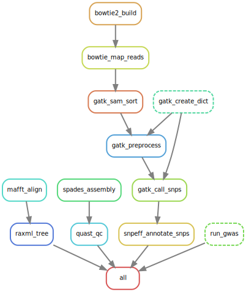

# BIOINFO221 Datasets

A collection of sample datasets and pipelines used for the BIOINFO221 course.

### Included Pipelines

1. Multiple Sequence Alignment (MAFFT) + Tree Inference (RAxML)
2. Sequence Assembly (spades) and Assessment (QUAST)
3. Read Mapping (bowtie2, samtools), Variant Calling (GATK) and Annotation (snpEff)
4. Genome Wide Association Study (r-qtl)

